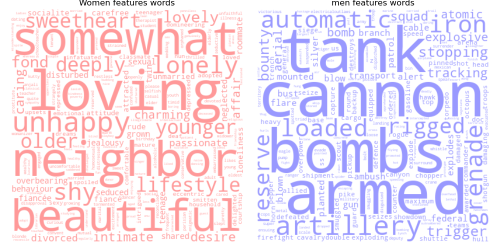
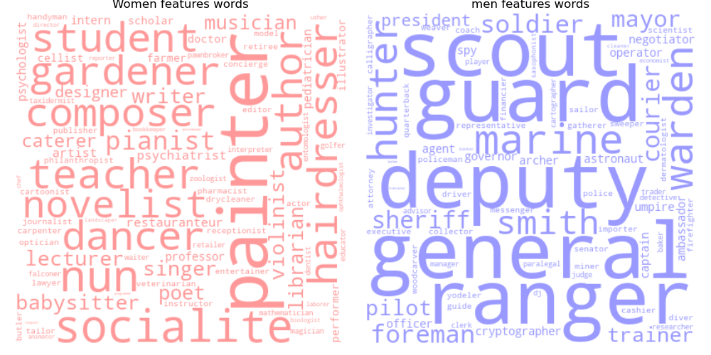

Now that we have explored a bit the proportion of women in movies we were wondering how they were described and if the way they were described differed a lot between men and women. To do so we analysed the words of the movie summaries using a bag of words (machine learning) on the movie summaries, as words carry lots of information. Once the model was trained we were able to compare words that were more similar to women and others which were more similar to men. 
Firstly we look at the adjectives the most used to describe women and how different they are between women and men. Secondly we wanted to see if women were associated to different jobs than men and if so which jobs they were. Finally we did a sentiment analysis to observe whether women were described with more intense sentiments than men.

# Adjectives analysis

The following two word clouds show adjectives associated with women and associated with men, focussing on the adjectives with the biggest differences regarding which gender they are used for. Even though our model also identified some words as adjectives which are not truly adjectives, such as "tank" or "cannon", the results are still very interesting. We can see that women are described with more soft and positive words, while men are described with words related to conflict and war.

The two barplots below depict the same information as the word cloud above, but they show in more detail how large the differences between men and women are for each of the words. 




# Sentiment analysis
To be completed...

# Jobs analysis
When looking at which jobs vary the most between women and men in movies, we can find similar results as with the adjectives above. Women are mostly doing graceful and artsy jobs, such as  dancer or painter, while men are more prone to have jobs related to conflict and authority, such as deputy or general. 

